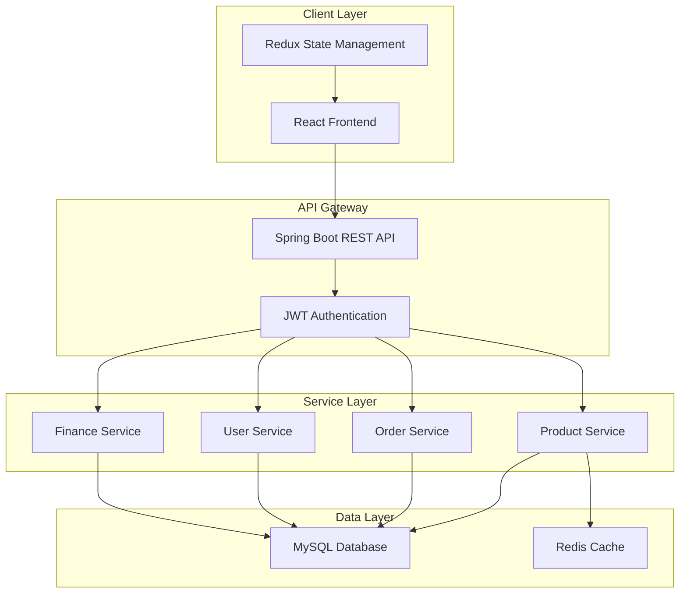
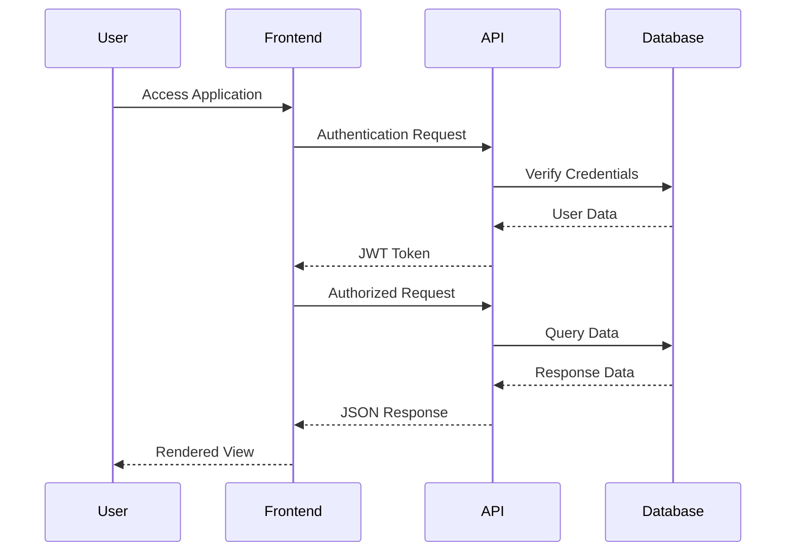

# E-Commerce Platform Documentation

## Table of Contents
1. [Project Overview](#project-overview)
2. [Architecture](#architecture)
3. [Installation Guide](#installation-guide)
4. [Folder Structure](#folder-structure)
5. [API Documentation](#api-documentation)
6. [Component Documentation](#component-documentation)
7. [Database Schema](#database-schema)
8. [Deployment Guide](#deployment-guide)
9. [Contributing Guidelines](#contributing-guidelines)

---

## Project Overview

### Description
A comprehensive e-commerce platform built with React.js (frontend) and Spring Boot (backend), featuring role-based access control, inventory management, GST billing, and support for both business and individual customers.

### Key Features
- 🛒 **Product Management**: Browse, search, and filter products
- 👥 **User Types**: Support for Business and Individual customers
- 💳 **Payment Integration**: Multiple payment methods
- 📊 **Admin Dashboard**: Comprehensive admin panel
- 💰 **Finance Module**: Invoice generation and GST calculations
- 📦 **Inventory Management**: Real-time stock tracking
- 🔐 **Security**: JWT authentication and role-based access

### Technology Stack

| Layer | Technology |
|-------|------------|
| Frontend | React 18, Redux Toolkit, Material-UI |
| Backend | Spring Boot 3.1.5, Spring Security |
| Database | MySQL 8.0 |
| Authentication | JWT |
| Build Tools | Maven, npm |
| Deployment | Docker, Docker Compose |

---

## Architecture

### System Architecture



### Application Flow



---

## Installation Guide

### Prerequisites

- Node.js 18+ and npm
- Java 17+
- MySQL 8.0
- Maven 3.8+
- Docker & Docker Compose (optional)

### Quick Start with Docker

```bash
# Clone the repository
git clone https://github.com/your-org/ecommerce-platform.git
cd ecommerce-platform

# Start all services
docker-compose up -d

# Access the application
# Frontend: http://localhost:3000
# Backend: http://localhost:8080
# Database: localhost:3306
```

### Manual Installation

#### Backend Setup

```bash
# Navigate to backend directory
cd backend

# Configure database
cp src/main/resources/application.yml.example src/main/resources/application.yml
# Edit application.yml with your database credentials

# Install dependencies and build
mvn clean install

# Run database migrations
mvn flyway:migrate

# Start the application
mvn spring-boot:run
```
POST :- http://localhost:8080/addresses

Payload:-
{
  "addressLine1": "Flat 101",
  "addressLine2": "MG Road",
  "city": "Pune",
  "state": "Maharashtra",
  "postalCode": "411001",
  "country": "India",
  "default": true
}

Response:-
{
    "id": 3,
    "addressLine1": "Flat 101",
    "addressLine2": "MG Road",
    "city": "Pune",
    "state": "Maharashtra",
    "country": "India",
    "postalCode": "411001",
    "type": null,
    "default": true
}

http://localhost:8080/api/products?page=0&size=10 This also working and no changes need.